# Upstream issue draft — plantuml/plantuml

> Filing note: the `<style>` one-line class bug mentioned during review is
> drafted separately in `.provide/plantuml-style-one-line-class-dropped-issue.md`.
> File them as two issues and cross-link the URLs.

**Title:** Regression in 1.2026.7: a background-coloured activity in certain control-flow positions fails to render ("Cannot find group", "Cannot find if", "Cannot find repeat", "Syntax Error?")

---

## Summary

Since **1.2026.7**, an activity diagram can fail to render when an activity carrying a background colour (`#RRGGBB:label;`) sits in certain control-flow positions. Every shape below renders on **1.2026.6**, and removing only the colour -- `#FFE0B2:coloured;` becomes `:coloured;` -- makes every one render on every version tested.

The same trigger surfaces as 4 different diagnostics depending on position: "Cannot find group", "Cannot find if", "Cannot find repeat", "Syntax Error?". They are reported here as one regression because they share the introducing release, the trigger, and the fix of removing the colour; they may well be separate faults underneath. The error is not always reported against the coloured activity's own line, which makes it hard to trace.

It is not tied to groups -- a coloured activity directly before an `if` fails with no `partition` or `repeat` anywhere -- and it is not every coloured activity: one followed by a plain activity, or ending an `if` branch whose sibling branch is non-empty, renders.

## Minimal reproducer

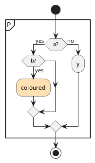

**Expected:** renders (and does, on 1.2026.6 and earlier).

**Actual**, on 1.2026.7 and 1.2026.8:

```
Error line 11 in file: repro.puml
Some diagram description contains errors
```

Line 11 is the `}` that closes the partition. The generated SVG is an error image reading
`Cannot find group (Assumed diagram type: activity)`.

The control — byte-identical except that `#FFE0B2:coloured;` becomes `:coloured;` — renders
on every version tested.

## Bisect

Each version run against both files, `java -jar plantuml-<v>.jar -tsvg`:

| version | coloured | uncoloured |
|---|---|---|
| 1.2026.0 | renders | renders |
| 1.2026.2 | renders | renders |
| 1.2026.4 | renders | renders |
| 1.2026.5 | renders | renders |
| 1.2026.6 | renders | renders |
| **1.2026.7** | **Cannot find group** | renders |
| **1.2026.8** | **Cannot find group** | renders |

## Not limited to groups

No `partition`, no `repeat`:

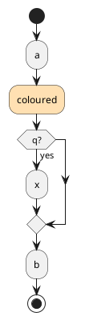

Renders on 1.2026.6. On 1.2026.7 and 1.2026.8 the image reads `Cannot find if`, reported against line 7 (`endif`). Uncoloured, it renders on all three.

## Every shape tested

Each shape run coloured and uncoloured with `java -jar plantuml-<version>.jar -tsvg`. The table shows the coloured result as the diagnostic PlantUML writes into the image; **every uncoloured variant renders on all three versions**, and 1.2026.7 and 1.2026.8 agree on every row.

| shape | 1.2026.6 | 1.2026.7 | 1.2026.8 |
|---|---|---|---|
| `s1_partition_if_no_else` — partition › nested `if` ending in the coloured activity, no `else` | renders | **Cannot find group** | **Cannot find group** |
| `s2_partition_if_empty_else` — partition › nested `if` ending in the coloured activity, empty `else` | renders | **Cannot find group** | **Cannot find group** |
| `s3_partition_if_nonempty_else` — partition › nested `if` ending in the coloured activity, non-empty `else` | renders | renders | renders |
| `s4_no_group_if_no_else` — no group › nested `if` ending in the coloured activity, no `else` | renders | renders | renders |
| `s5_repeat_body` — repeat body: plain, coloured, plain | renders | renders | renders |
| `s6_repeat_if_empty_else` — repeat › `if` whose branch is coloured activity + `stop`, empty `else` | renders | **Cannot find repeat** | **Cannot find repeat** |
| `s7_repeat_if_nonempty_else` — repeat › `if` whose branch is coloured activity + `stop`, non-empty `else` | renders | renders | renders |
| `s8_after_repeat` — coloured activity directly after `repeat while` | renders | **Syntax Error?** | **Syntax Error?** |
| `s9_after_partition` — coloured activity directly after a partition's `}` | renders | **Syntax Error?** | **Syntax Error?** |
| `t1_repeat_before_if` — repeat › coloured activity directly before an `if` (no `else`) | renders | **Cannot find if** | **Cannot find if** |
| `t2_repeat_before_if_else` — repeat › coloured activity directly before an `if`/`else` | renders | **Cannot find if** | **Cannot find if** |
| `t3_partition_before_if` — partition › coloured activity directly before an `if` | renders | **Cannot find if** | **Cannot find if** |
| `t4_no_group_before_if` — **no group** › coloured activity directly before an `if` | renders | **Cannot find if** | **Cannot find if** |
| `t5_repeat_last_before_close` — repeat › coloured activity last before `repeat while` | renders | **Syntax Error?** | **Syntax Error?** |
| `t6_partition_last_before_close` — partition › coloured activity last before `}` | renders | **Syntax Error?** | **Syntax Error?** |

What the rows show, without claiming a rule behind them:

- followed by a plain activity, the coloured activity renders (`s5`); ending a branch whose sibling is non-empty, it renders (`s3`, `s7`);
- directly before an `if` it fails, inside a group or not (`t1`-`t4`);
- as the last statement before a group closes it fails (`t5`, `t6`); directly after one closes it fails too (`s8`, `s9`), and `s8` reads `Syntax Error?`;
- ending an `if` branch with an empty or absent `else` fails inside a group (`s1`, `s2`, `s6`) but renders with no group (`s4`).

<details>
<summary>Exact source of every coloured shape (the uncoloured control replaces <code>#FFE0B2:coloured;</code> with <code>:coloured;</code>)</summary>

`s1_partition_if_no_else` — partition › nested `if` ending in the coloured activity, no `else`


`s2_partition_if_empty_else` — partition › nested `if` ending in the coloured activity, empty `else`

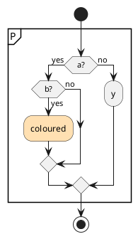

`s3_partition_if_nonempty_else` — partition › nested `if` ending in the coloured activity, non-empty `else`

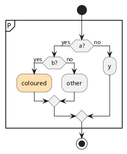

`s4_no_group_if_no_else` — no group › nested `if` ending in the coloured activity, no `else`

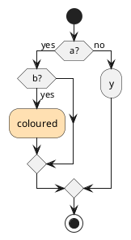

`s5_repeat_body` — repeat body: plain, coloured, plain

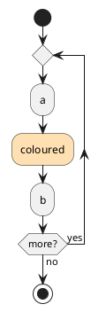

`s6_repeat_if_empty_else` — repeat › `if` whose branch is coloured activity + `stop`, empty `else`

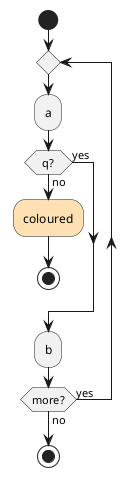

`s7_repeat_if_nonempty_else` — repeat › `if` whose branch is coloured activity + `stop`, non-empty `else`

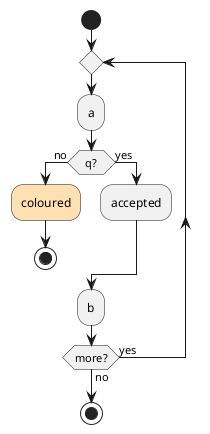

`s8_after_repeat` — coloured activity directly after `repeat while`

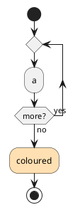

`s9_after_partition` — coloured activity directly after a partition's `}`

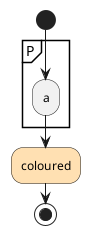

`t1_repeat_before_if` — repeat › coloured activity directly before an `if` (no `else`)

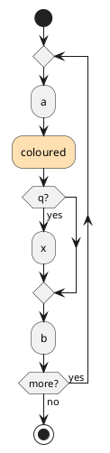

`t2_repeat_before_if_else` — repeat › coloured activity directly before an `if`/`else`

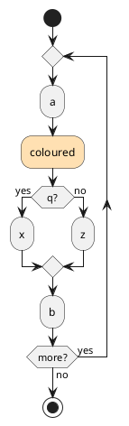

`t3_partition_before_if` — partition › coloured activity directly before an `if`

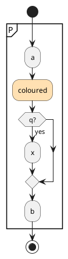

`t4_no_group_before_if` — **no group** › coloured activity directly before an `if`


`t5_repeat_last_before_close` — repeat › coloured activity last before `repeat while`

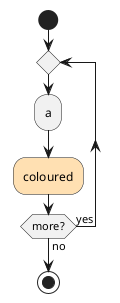

`t6_partition_last_before_close` — partition › coloured activity last before `}`

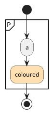

</details>

## Workaround, and why it is not a general one

Moving the colour to a `<style>` class renders on 1.2026.7+:

```plantuml
<style>
.downgrade {
  BackgroundColor #FFE0B2
  LineColor #C79B4E
}
</style>
...
      :coloured; <<downgrade>>
```

That form fails on 1.2020.02 (the version Debian/Ubuntu still ship) with the same
`Cannot find group`, so of the two per-activity colour spellings I tested, neither
preserves the styling across both releases.

## Environment

- PlantUML 1.2026.6, 1.2026.7 and 1.2026.8 release jars from GitHub for the shape table; 1.2026.0-1.2026.8 for the bisect
- OpenJDK 26.0.2.1 (Homebrew), macOS arm64 — every 1.2026.x run above was on this host
- The 1.2020.02 comparison in the workaround section was Ubuntu 24.04's `plantuml` package under `openjdk-21-jre`
- Graphviz present and working; unrelated to layout backend
