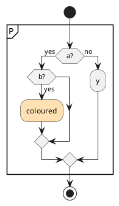
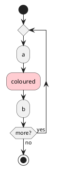

# Upstream issue draft — plantuml/plantuml

> Filing note: the `<style>` one-line class bug mentioned during review is
> drafted separately in `.provide/plantuml-style-one-line-class-dropped-issue.md`.
> File them as two issues and cross-link the URLs.

**Title:** Regression in 1.2026.7: "Cannot find group" for a background-coloured activity in certain group/branch shapes

---

## Summary

Since **1.2026.7**, an activity diagram can fail to render with `Cannot find group` when
an activity carrying a background colour (`#RRGGBB:label;`) appears in certain shapes
inside a `partition { }` or a `repeat` group. The identical diagram renders through
**1.2026.6**. Removing only the colour — changing `#FFE0B2:coloured;` to `:coloured;` —
makes it render on every version tested.

It is not every coloured activity in a group: one inside an `if` branch whose sibling
branch is non-empty renders fine on 1.2026.8. The reproducer below is the smallest shape
I found that fails.

The error is reported against the line that closes the group, not the coloured activity,
which makes it hard to trace back to the real cause.

## Minimal reproducer



**Expected:** renders (and does, on 1.2026.6 and earlier).

**Actual**, on 1.2026.7 and 1.2026.8:

```
Error line 11 in file: repro.puml
Some diagram description contains errors
```

Line 11 is the `}` that closes the partition. The generated SVG is an error image reading
`Cannot find group (Assumed diagram type: activity)`.

The control — byte-identical except that `#FFE0B2:coloured;` becomes `:coloured;` — renders
on every version tested.

## Bisect

Each version run against both files, `java -jar plantuml-<v>.jar -tsvg`:

| version | coloured | uncoloured |
|---|---|---|
| 1.2026.0 | renders | renders |
| 1.2026.2 | renders | renders |
| 1.2026.4 | renders | renders |
| 1.2026.5 | renders | renders |
| 1.2026.6 | renders | renders |
| **1.2026.7** | **Cannot find group** | renders |
| **1.2026.8** | **Cannot find group** | renders |

## Second shape: `repeat`

Not limited to `partition`. This fails the same way on 1.2026.7+:



## What does and does not trigger it

From narrowing a real diagram, on 1.2026.8:

- A coloured activity inside an `if` branch that has a **non-empty sibling branch** renders.
- A coloured activity whose `if` has an **empty** `else`, or **no** `else`, fails.
- A coloured activity directly in a `repeat` body, or directly after the group closes, fails.
- The colour is the only discriminator in every case: the uncoloured form always renders.

## Workaround, and why it is not a general one

Moving the colour to a `<style>` class renders on 1.2026.7+:

```plantuml
<style>
.downgrade {
  BackgroundColor #FFE0B2
  LineColor #C79B4E
}
</style>
...
      :coloured; <<downgrade>>
```

That form fails on 1.2020.02 (the version Debian/Ubuntu still ship) with the same
`Cannot find group`, so of the two per-activity colour spellings I tested, neither
preserves the styling across both releases.

## Environment

- PlantUML 1.2026.8 / 149874a (2026-09-05), GPL source distribution
- OpenJDK 26.0.2.1 (Homebrew), macOS arm64 — every 1.2026.x run above was on this host
- The 1.2020.02 comparison was Ubuntu 24.04's `plantuml` package under `openjdk-21-jre`
- Graphviz present and working; unrelated to layout backend
