# Upstream issue draft — plantuml/plantuml

> Filing note: file separately from the "Cannot find group" regression
> (`.provide/plantuml-1.2026.7-regression-issue.md`) and cross-link the two
> issue URLs once both exist. They were found together but are unrelated
> defects; the draft review asked for them to be split.

**Title:** A `<style>` class with space-separated properties on one line is discarded entirely, with no error

---

## Summary

A `<style>` class whose properties share one line separated only by
whitespace -- `.k { BackgroundColor #F6E7C8  LineColor #C79B4E }` -- is dropped
as a whole. **Neither** property is applied to elements tagged `<<k>>`, not
even the well-formed first one. PlantUML exits 0, prints nothing, and writes
no error banner into the image, so the only symptom is a diagram that renders
in default colours.

The same properties separated by `;` on one line, or written one per line,
work.

This is not a recent regression: the behaviour is identical on 1.2026.0,
1.2026.6 and 1.2026.8.

## Reproducer

```plantuml
@startuml a_two_spaces
<style>
.k { BackgroundColor #F6E7C8  LineColor #C79B4E }
</style>
start
:tagged; <<k>>
stop
@enduml
```

**Expected:** the tagged activity is filled `#F6E7C8` with a `#C79B4E` border
-- or, if whitespace-separated properties are not valid syntax, an error or
warning naming the class and the declaration it could not parse.

**Actual:** the activity renders in the default style. Exit status 0, no
output on stdout or stderr, no error text in the SVG.

## Control

Byte-identical except that the properties are separated by `;`:

```plantuml
@startuml c_semicolon
<style>
.k { BackgroundColor #F6E7C8; LineColor #C79B4E }
</style>
start
:tagged; <<k>>
stop
@enduml
```

Renders with both the fill and the border applied.

## Results

Each case run as `java -jar plantuml-<version>.jar -tsvg`, then the SVG
searched for the fill (`fill="#F6E7C8"`) and the border (`stroke` `#C79B4E`).
The results were identical on 1.2026.0, 1.2026.6 and 1.2026.8:

| class body | exit | output | fill applied | border applied |
|---|---|---|---|---|
| `{ BackgroundColor #F6E7C8  LineColor #C79B4E }` (two spaces) | 0 | none | **no** | **no** |
| `{ BackgroundColor #F6E7C8 LineColor #C79B4E }` (one space) | 0 | none | **no** | **no** |
| `{ BackgroundColor #F6E7C8; LineColor #C79B4E }` | 0 | none | yes | yes |
| `{ BackgroundColor #F6E7C8 }` | 0 | none | yes | n/a |
| one property per line | 0 | none | yes | yes |

## Why the silence is the problem

The syntax question may have a simple answer. The style documentation I found,
<https://plantuml.com/style-evolution>, shows only single-property blocks and
does not say how several properties on one line should be separated, so it is
not clear whether whitespace separation was ever meant to work. If it was not,
that is fine -- but the current behaviour gives no way to find out.

Because the render succeeds, anything downstream succeeds with it. A build
that regenerates diagrams and checks they render will regenerate a diagram
with its styling gone and report success. The only way to notice is to
inspect the colours in the output, which is how this was found.

Either of these would resolve it:

1. accept whitespace-separated properties on one line, as `;` already is; or
2. report a warning or error naming the class and the declaration that could
   not be parsed.

Separately from which of those is chosen, discarding the valid
`BackgroundColor` because a later declaration on the same line is malformed
seems worth avoiding: the failure is wider than the mistake.

## Environment

- PlantUML 1.2026.0, 1.2026.6 and 1.2026.8, release jars from GitHub
- OpenJDK 26.0.2.1 (Homebrew), macOS arm64
- Activity diagram; no Graphviz layout involved
